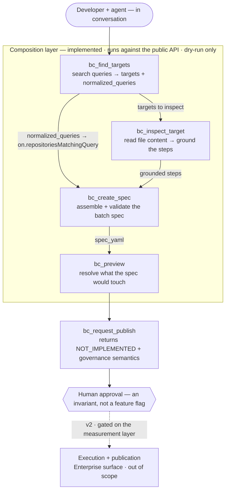

# MCP for Batch Changes — a governed write port (POC)

> **Status:** POC v1 · **dry-run only** · human approval is an invariant, not a feature flag · all 5 tools implemented.

An exploration of one idea: expose Sourcegraph **Batch Changes** through an **MCP** server so that an agent can *compose* a batch change in conversation with a developer — discover targets, inspect code, assemble and validate the declarative spec, preview what it would touch — while **publication stays behind explicit human approval**.

This repository is two things at once: a small, runnable artifact, and the reasoning behind it. The reasoning lives in [`docs/`](docs/) and is the primary deliverable; the code exists to make the argument concrete and to feel the integration surface first-hand.

---

## The proposal, in brief

Sourcegraph's Code Plane owns both the agent integration layer (MCP) and the action layer (Batch Changes) — but today MCP only transports *read* capabilities from the neighboring Code Understanding surface. This POC sketches an MCP **write port** over the Batch Changes domain — five tools an agent drives, in conversation with a developer, to compose a batch change from search results:



Discovery feeds composition directly: a `bc_find_targets` `normalized_queries` entry becomes the spec's `on.repositoriesMatchingQuery`, and `bc_inspect_target` grounds the transformation steps. Everything up to `bc_preview` is **dry-run** against the public API; `bc_request_publish` is the governed refusal — the thesis demonstrated by what it *won't* do.

The structured batch spec is not a limitation — it is the guardrail: an agent that proposes a *validatable, diffable, human-reviewable* artifact before anything executes is the enterprise-viable shape of agent-driven change. v1 deliberately refuses to publish, because the measurement layer that would make publication safe (blast-radius scoring, CI-signal tiering, canary stop rules) does not yet exist.

**The full argument — strategic read, hands-on teardown, the hypothesis, and why v1 is dry-run-only — is in the dense documents. Start here:**

| Doc | What it covers |
|---|---|
| [`01-code-plane-analysis.md`](docs/01-code-plane-analysis.md) | The complete analysis: strategy, the two organizational curiosities, the hypothesis, the measurement gap |
| [`02-architecture.md`](docs/02-architecture.md) | Design axioms, the package tree, import rules, prepared defenses |
| [`03-tool-contracts.md`](docs/03-tool-contracts.md) | Input/output/error contracts for all five tools + the demo narrative |
| [`04-build-plan.md`](docs/04-build-plan.md) | Build cycles and the primary-source verification checklist |

---

## The tools

| Tool | Purpose | Status |
|---|---|---|
| `bc_find_targets` | Turn search queries into batch-change targeting (the `on:` clause factory) — searched in parallel, merged into per-repo counts + sample paths + normalized queries | ✅ implemented |
| `bc_inspect_target` | Fetch full file content in the context of a target, to ground a transformation | ✅ implemented |
| `bc_create_spec` | Compose and validate the declarative batch spec (pure; never executes) | ✅ implemented |
| `bc_preview` | Resolve what the spec *would* touch, without touching anything | ✅ implemented |
| `bc_request_publish` | Contract only — returns `NOT_IMPLEMENTED` plus the governance semantics. The refusal *is* the deliverable | ✅ implemented (contract) |

**Public-API boundary:** target resolution and file reading run for real against the public Sourcegraph instance. Step execution and publication are Enterprise surfaces and are **out of scope** — `bc_request_publish` ships as a documented contract, not an implementation.

---

## Repository structure

```
mcp/bc/
    cmd/server/        → MCP entry point: wiring + tool registration (stdio)
    findtargets/       → use case (bc_find_targets)
    inspecttarget/     → use case (bc_inspect_target)
    createspec/        → use case (bc_create_spec)
    preview/           → use case (bc_preview)
    requestpublish/    → use case (bc_request_publish, contract-only)
    internal/
        batchspec/     → the product's central artifact: aggregate, invariants, YAML
        targeting/     → value objects: normalized Query + resolved Targets
        sgclient/      → Sourcegraph transport: HTTP, auth, GraphQL, error mapping
        apperr/        → coded application errors (contract code + message) shared
                         by the use cases and rendered by the server
        fanout/        → run independent context-aware operations concurrently,
                         joined in order (used by bc_find_targets' parallel search)
docs/                  → the analysis and design documents (the primary deliverable)
```

**Reading rule (no extra docs needed):** `cmd/` is the entry point, `internal/` is support — everything else at that level **is a use case**, by elimination. The top level screams what the product does; navigate down for how. Use cases own their full vertical (their own narrow interface, query, and tests) and **never import each other** — a rule enforced mechanically (see [Static analysis](#static-analysis) below).

---

## The architecture trade

This layout is deliberately *not* the idiomatic flat Go default, and that cost was priced on purpose:

> The flat layout assumes maintainer seniority and continuity — "split when it hurts" requires someone present who feels the pain and refactors. Consolidated architecture is insurance against team variance: it encodes long-term structure up front.

On collision, Clean Architecture / DDD / Hexagonal win over DRY/YAGNI/KISS here — a conscious trade, documented rather than implied. See [`02-architecture.md`](docs/02-architecture.md) for the full axiom set and the prepared defenses.

---

## Getting started

**Prerequisites:** Go 1.25+.

**Configuration** (via environment, [12-factor](https://12factor.net/config) — see [`.env.example`](.env.example)):

| Variable | Required | Purpose |
|---|---|---|
| `SG_BASE_URL` | **yes** | Sourcegraph GraphQL endpoint, e.g. `https://sourcegraph.com/.api/graphql`. Also settable with `-endpoint`. |
| `SG_ACCESS_TOKEN` | no | Access token, sent as `Authorization: token …`. The public instance needs none; enterprise instances do. |

The server **fails fast** if no endpoint is configured (it does not assume a default), so misconfiguration is caught at startup, not as a confusing `UPSTREAM_UNAVAILABLE` per call.

```sh
export SG_BASE_URL=https://sourcegraph.com/.api/graphql   # required
# export SG_ACCESS_TOKEN=…                                # enterprise only
go run ./mcp/bc/cmd/server
```

Locally, `direnv` (an [`.envrc`](.envrc) with `dotenv`) or `set -a; . ./.env; set +a` loads `.env` for you; in CI/CD the variables are injected by the platform. The binary itself reads only the environment — it never loads a `.env` file.

**Connecting an MCP client** (e.g. Claude Code) — build a binary and point the client at it over stdio, passing the config through:

```sh
go build -o /tmp/bc-server ./mcp/bc/cmd/server
```

```json
{
  "mcpServers": {
    "bc": {
      "command": "/tmp/bc-server",
      "env": { "SG_BASE_URL": "https://sourcegraph.com/.api/graphql" }
    }
  }
}
```

---

## Development

```sh
go test ./...        # full suite (unit tests use httptest with canned GraphQL)
go test -race ./...  # race-enabled
go vet ./...
```

### Local environment via direnv (caveat: must be activated)

The tracked [`.envrc`](.envrc) loads `.env` for you — but direnv only runs once it's installed **and hooked into your shell**, and the hook is **not** automatic. `direnv allow` alone does nothing without the hook. One-time setup:

```sh
brew install direnv                            # if not already installed

# Hook direnv into your shell (zsh shown) — add at/near the END of the file:
echo 'eval "$(direnv hook zsh)"' >> ~/.zshrc   # bash: direnv hook bash >> ~/.bashrc
source ~/.zshrc

cp .env.example .env                           # then fill in SG_BASE_URL (+ token if enterprise)
direnv allow                                   # trust this repo's .envrc, once per clone
echo "SG_BASE_URL=$SG_BASE_URL"                # verify it loaded
```

Note: direnv exports into your **interactive shell**, so a server spawned by a GUI-launched MCP client won't inherit it — for those, put the vars in the client's `env` block (see [Getting started](#getting-started)).

### Pre-commit hook (caveat: must be activated)

A tracked hook in [`.githooks/pre-commit`](.githooks/pre-commit) runs **gofmt → go vet → golangci-lint → go test** and aborts the commit on any failure. Because `.git/hooks/` is not versioned, the hook must be activated **once per clone**:

```sh
git config core.hooksPath .githooks
```

Bypass for a single commit (e.g. WIP) with `git commit --no-verify`.

### Static analysis

The hook runs `golangci-lint` if it is installed, and **skips it with a warning if not**. That tool carries the real architectural enforcement: the `depguard` rule in [`.golangci.yml`](.golangci.yml) forbids lateral imports between use cases. Without it, only `go vet` runs and that invariant is **not** checked. Install it for full coverage:

```sh
brew install golangci-lint   # or see https://golangci-lint.run
```

---

## Scope and caveats

- **Dry-run only.** v1 composes, validates and previews. It never executes or publishes. This is an invariant.
- **Hypothesis-grade.** The analysis is an external read; claims about Enterprise-only surfaces are framed as hypotheses, with a primary-source verification checklist in [`04-build-plan.md`](docs/04-build-plan.md).
- **Not a generic search tool.** `bc_find_targets` shapes output for spec composition, not browsing — the official Sourcegraph MCP already exposes generic read tools, and duplicating them would be incoherent.

---

## What this is, underneath

The runnable server is the smaller half. The actual exercise is this: **take only public information about Sourcegraph — the docs, the engineering blog, a job description — and find where the enterprise product has leverage it isn't using yet.** The two curiosities in [`01-code-plane-analysis.md`](docs/01-code-plane-analysis.md) §3 are read out of *absences* in those public sources, not insider access: MCP transports only read capabilities even though Code Plane owns the action layer next door; the arm that performs mass change and the arm that measures code over time sit in one org and don't touch. Both most likely reflect ordinary sequencing rather than oversight — but each marks, precisely, where a governed write port would extend the enterprise plan into a shape it can't currently express: Batch Changes driven by a hosted agent under an auth scope that can say "propose but not publish," which shell access can't. The POC exists to prove that read is concrete enough to build, not to be the product. And the write port isn't its only payload: pieces of it generalize back into the existing surfaces — a preview step that resolves a change's blast radius *before* it runs (in the UI and the CLI, not only through an agent), and a plan/capacity layer that predicts and schedules *how and when* a large change lands rather than firing it all at once. Those are enterprise enhancements the same analysis points to, independent of whether the MCP framing is the one that ships. If the analysis is right, the code is the cheap part; if it's wrong, no amount of code would save it — which is why the documents, not the binary, are what's being submitted for review.
